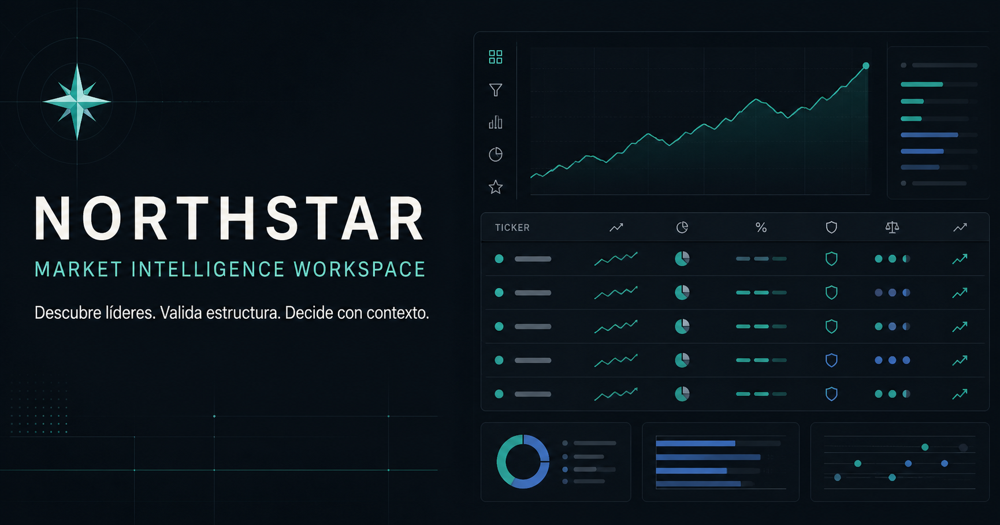

# Northstar Market Intelligence

[Abrir Northstar en internet](https://santiago9505.github.io/screening/)

Northstar es un workspace profesional para descubrir líderes, leer la amplitud del mercado, validar estructuras técnicas y combinar precio, volumen, Relative Strength y fundamentales en una sola superficie de análisis. Su motor SEPA está inspirado en la metodología de Mark Minervini y mantiene cada decisión auditable.



## Qué incluye

- Universo líquido de acciones de EE. UU. con precios y métricas de TradingView.
- Pulso de mercado: amplitud, cambio medio, porcentaje sobre SMA 50 y líderes RS 80+.
- Ranking técnico con Relative Strength, medias, volumen relativo y setup score.
- Gráfico profesional de TradingView con SMA 50, 150 y 200.
- Filtros por precio, volumen, RS, medias y fundamentales.
- Watchlists manuales y dinámicas persistidas en el dispositivo.
- Listas de momentum: Trend Template, líderes RS 90+ y candidatos cerca de ruptura.
- Panel de contexto técnico y fundamental por acción.
- Centro de comando SEPA con régimen `GO`, `CAUTIOUS`, `DEFENSIVE` y `WATCH ONLY`.
- Copiloto local explicable: interpreta consultas en español como `RS 90, EPS y ventas > 25%, cerca de máximos`.
- Score de 100 puntos: universo (10), fundamentales (25), tendencia (20), liderazgo (15), setup (15) y accionabilidad (15).
- Radar de Trend Template, VCP, Power Play, Primary Base, Breakout y Low Cheat.
- Plan de riesgo por candidato con referencia de trigger, stop estructural, ROTE 1.25% y posición máxima sugerida.
- Estados operativos separados: `Actionable`, `Close`, `Watch`, `Uncovered` y `Reject`.
- Feedback de setups y laboratorio histórico cuando está conectado el motor privado.
- Navegación por teclado y diseño adaptable.

## Dos modos, una sola experiencia

### Web

La versión de GitHub Pages consume un snapshot EOD de TradingView generado dentro del workflow y servido desde el mismo dominio. No necesita servidor, Firebase ni API keys en el navegador, evita bloqueos CORS y abre el universo con una sola descarga cacheable. El copiloto y el ranking corren localmente en el dispositivo para conservar velocidad y explicabilidad. El correo privado y el histórico de setups permanecen desactivados por seguridad.

### Escritorio / motor privado

Cuando el frontend corre en `localhost`, Northstar usa automáticamente el motor de `server.js`. Esto habilita fundamentales trimestrales, presets avanzados, feedback persistente, Setup Lab y el módulo privado de correo.

La interfaz anterior sigue disponible con `?legacy=1` como ruta de compatibilidad.

## Desarrollo local

Requisitos: Node.js 20 o superior.

```bash
npm install
npm run build
npm test
```

El usuario puede iniciar por separado el frontend y el motor privado:

```bash
npm run dev
npm run server
```

## Configuración

- `VITE_API_BASE_URL`: URL opcional de un motor privado desplegado.
- `VITE_BASE_PATH`: base pública de Vite; GitHub Pages usa `/screening/`.
- `FINNHUB_API_KEY`: se mantiene exclusivamente en el entorno del servidor para fundamentales trimestrales.

No publiques archivos `.env` ni claves dentro del frontend.

## Cómo leer el radar

`Actionable` exige score mínimo de 85, Trend Template, RS 70+, fundamentales cubiertos y una entrada no extendida. `Close` y `Watch` conservan candidatos útiles sin confundir calidad con timing. `Uncovered` significa que faltan datos fundamentales; nunca se convierten silenciosamente en ceros.

VCP, Power Play, Primary Base y otros patrones aparecen como `radar` o `candidate` cuando se infieren desde el snapshot diario. El pivot, las contracciones, la pendiente de SMA 200 y la calidad real de la base deben confirmarse en el gráfico. Esta separación evita presentar una inferencia como un hecho observado.

## Publicación

El workflow de GitHub Actions compila TypeScript, genera el build de producción y publica `dist` en GitHub Pages con cada push a `codex/northstar`.

## Stack

React 18, TypeScript, Vite, Tailwind CSS, TradingView Scanner, TradingView Advanced Chart, Express y Node Test Runner.

> La información mostrada es de mercado y no constituye asesoría financiera.
